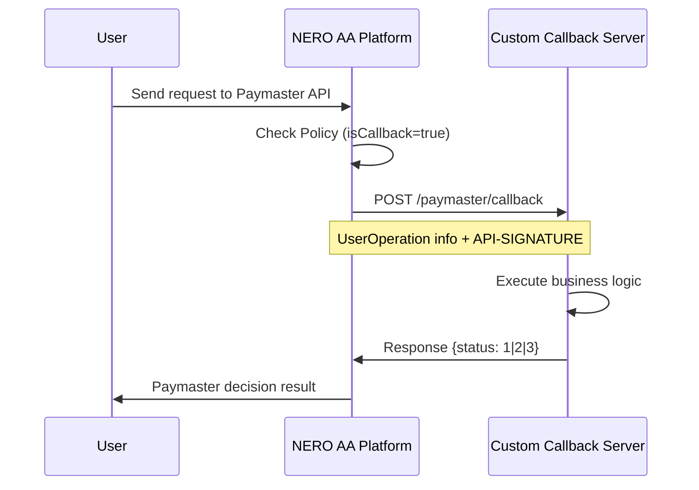

import PageFeedback from "../../../../components/PageFeedback";

# Callback Function

## Overview

The NERO AA Platform provides a custom callback function for Paymaster (gas fee sponsorship) decisions. This allows project developers to control free gas fee sponsorship based on their own business logic.

## Architecture



## Configuration

### 1. Project Policy Settings

Enable the callback function from the management console and configure the callback URL.

<div style={{ height: "2rem" }} />
<div style={{ textAlign: "center" }}>
  
  <p style={{ fontStyle: "italic" }}>Figure 12: spacify callback</p>
</div>

### 2. API Call

```bash
POST /v1/apiKey/policy/saveOrUpdate
{
  "projectId": 123,
  "policy": {
    "isCallback": true,
    "callbackUrl": "https://your-callback-server.com/paymaster/callback"
  }
}
```

## Callback Protocol

### Request Specification

- URL: Callback URL specified in project settings
- Method: POST
- Content-Type: application/json
- Timeout: 2 seconds

### Headers

```jsx
API-SIGNATURE: MD5 hash signature
Content-Type: application/json
```

### Request Body

```json
{
  "sender": "0x1234...",
  "nonce": "0x1",
  "initCode": "0x",
  "callData": "0x...",
  "callGasLimit": "0x5208",
  "verificationGasLimit": "0x5208",
  "preVerificationGas": "0x5208",
  "maxFeePerGas": "0x3b9aca00",
  "maxPriorityFeePerGas": "0x3b9aca00",
  "paymasterAndData": "0x",
  "signature": "0x..."
}
```

### Signature Verification

The signature is generated through the following steps:

1. Sort request body keys in dictionary order
2. Concatenate in `key + value` format
3. Append the project's `callbackKey` at the end
4. Calculate MD5 hash

### Response Specification

```json
{
  "status": 1 // 1: PASS, 2: NOT_PASS, 3: LIMITED
}
```

### Status Values

| Status   | Value | Meaning  | Action                           |
| -------- | ----- | -------- | -------------------------------- |
| PASS     | 1     | Approved | Provide free gas fee sponsorship |
| NOT_PASS | 2     | Rejected | Deny free gas fee sponsorship    |
| LIMITED  | 3     | Limited  | Mark as limited state            |

## Sample Implementation

Below is an example callback server implementation:

```tsx
import { Hono } from "hono";
import { serve } from "@hono/node-server";

interface PaymasterSupportedToken {
  sender: string;
  nonce: string;
  initCode: string;
  callData: string;
  callGasLimit: string;
  verificationGasLimit: string;
  preVerificationGas: string;
  maxFeePerGas: string;
  maxPriorityFeePerGas: string;
  paymasterAndData: string;
  signature: string;
}

interface PaymasterRule {
  is_sponsored: boolean;
  is_blocked: boolean;
}

const paymasterRules: Map<string, PaymasterRule> = new Map([
  [
    "0x123456789abcdefghijk123456789abcdefghijk".toLowerCase(),
    { is_sponsored: true, is_blocked: false },
  ],
  // Add other address rules
]);

// Business logic evaluation function
function evaluateFreeGasEligibility(sender: string): number {
  const senderLower = sender.toLowerCase();
  const rule = paymasterRules.get(senderLower);
  if (!rule) {
    console.warn("Sender address not found in rules:", sender);
    return 2; // NOT_PASS - Reject addresses not in rules
  }
  // default: block paymaster support
  let supportStatus = 2;
  if ([rule.is](http://rule.is)_sponsored && _blocked) {
    supportStatus = 1; // PASS
  }
  return supportStatus;
}
```

## Operation Flow

1. **User submits UserOperation**
   - Request sent from frontend to NERO AA Platform
2. **Platform initiates decision process**
   - Check project Policy
   - Execute callback if `isCallback=true` and `callbackUrl` is configured
3. **Send callback request**
   - Send UserOperation information in JSON format
   - Verify signature with API-SIGNATURE header
4. **Execute business logic on custom server**
   - Check address whitelist
   - Verify usage limits
   - Other custom validations
5. **Process response**
   - Make Paymaster decision based on status
   - Execute or deny gas fee sponsorship

## Error Handling

### Callback Server Errors

- **Timeout (2 seconds)**
  - Fallback to other decision logic (confDiscount, isAll)
- **Network errors**
  - Throw PlatformException and output error logs
- **Invalid response**
  - "callback status is not valid" error

## Best Practices

1. **Fast Response**
   - Return response within 2 seconds
   - Execute heavy processing asynchronously
2. **Redundancy**
   - Configure load balancer with multiple server instances
   - Minimize downtime
3. **Security**
   - Implement mandatory signature verification
   - Enforce HTTPS communication
4. **Log Management**
   - Keep logs of decision results
   - Use as audit trail
5. **Fallback**
   - Prepare alternative logic for callback failures
   - Emergency manual override function

## Limitations

- Callback URL: Maximum 200 characters
- Request timeout: Fixed at 2 seconds
- Signature algorithm: MD5 fixed
- Protocol: HTTPS recommended (HTTP allowed)
- Concurrency: One callback URL per project

<PageFeedback path="/en/developer-tools/aa-platform/troubleshooting" />
