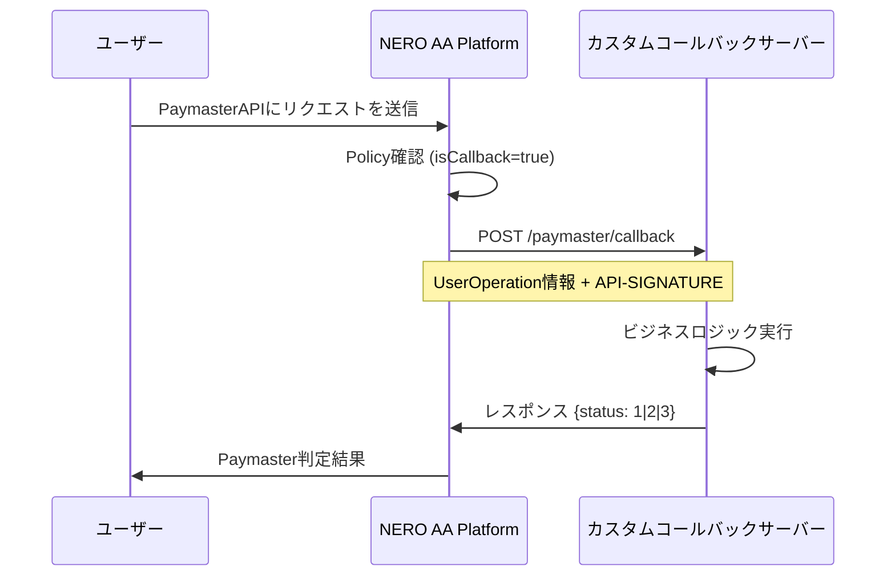

import PageFeedback from "../../../../components/PageFeedback";

# NERO AA Platform - Callback 機能

## 概要

NERO AA Platform では、Paymaster（ガス代支援）の判定にカスタムコールバック機能を提供しています。これにより、プロジェクト開発者は独自のビジネスロジックに基づいてガス代の無料支援を制御できます。

## アーキテクチャ



## 設定方法

### 1. プロジェクトポリシー設定

管理画面からコールバック機能を有効化し、コールバック URL を設定します。

<div style={{ height: "2rem" }} />
<div style={{ textAlign: "center" }}>
  
  <p style={{ fontStyle: "italic" }}>Figure 12: spacify callback</p>
</div>

### 2. API 呼び出し

```bash
POST /v1/apiKey/policy/saveOrUpdate
{
  "projectId": 123,
  "policy": {
    "isCallback": true,
    "callbackUrl": "https://your-domain.com/paymaster/callback"
  }
}
```

## コールバックプロトコル

### リクエスト仕様

- URL: プロジェクト設定で指定したコールバック URL
- メソッド: POST
- Content-Type: application/json
- タイムアウト: 2 秒

### ヘッダー

```
API-SIGNATURE: MD5ハッシュ署名
Content-Type: application/json
```

### リクエストボディ

```json
{
  "sender": "0x1234...",
  "nonce": "0x1",
  "initCode": "0x",
  "callData": "0x...",
  "callGasLimit": "0x5208",
  "verificationGasLimit": "0x5208",
  "preVerificationGas": "0x5208",
  "maxFeePerGas": "0x3b9aca00",
  "maxPriorityFeePerGas": "0x3b9aca00",
  "paymasterAndData": "0x",
  "signature": "0x..."
}
```

### 署名検証

署名は以下の手順で生成されます。

1. リクエストボディのキーを辞書順でソート
2. `key + value` の形式で連結
3. 末尾にプロジェクトの `callbackKey` を追加
4. MD5 ハッシュを計算

### レスポンス仕様

```json
{
  "status": 1 // 1: PASS, 2: NOT_PASS, 3: LIMITED
}
```

### ステータス値

| ステータス | 値  | 意味 | 動作                 |
| ---------- | --- | ---- | -------------------- |
| PASS       | 1   | 承認 | ガス代無料支援を提供 |
| NOT_PASS   | 2   | 拒否 | ガス代無料支援を拒否 |
| LIMITED    | 3   | 制限 | 制限状態としてマーク |

## サンプル実装

以下は コールバックサーバーの実装例です。

```tsx
import { Hono } from "hono";
import { serve } from "@hono/node-server";

interface PaymasterSupportedToken {
  sender: string;
  nonce: string;
  initCode: string;
  callData: string;
  callGasLimit: string;
  verificationGasLimit: string;
  preVerificationGas: string;
  maxFeePerGas: string;
  maxPriorityFeePerGas: string;
  paymasterAndData: string;
  signature: string;
}

interface PaymasterRule {
  is_sponsored: boolean;
  is_blocked: boolean;
}

const paymasterRules: Map<string, PaymasterRule> = new Map([
  [
    "0x123456789abcdefghijk123456789abcdefghijk".toLowerCase(),
    { is_sponsored: true, is_blocked: false },
  ],
  // 他のアドレスルールを追加
]);

// ビジネスロジック判定関数
function evaluateFreeGasEligibility(sender: string): number {
  const senderLower = sender.toLowerCase();
  const rule = paymasterRules.get(senderLower);
  if (!rule) {
    console.warn("Sender address not found in rules:", sender);
    return 2; // NOT_PASS - ルールに存在しないアドレスは拒否
  }
  // default: block paymaster support
  let supportStatus = 2;
  if ([rule.is](http://rule.is)_sponsored) {
    supportStatus = 1;
  }
  if ([rule.is](http://rule.is)_blocked) {
    supportStatus = 3;
  }
  return supportStatus;
}

const app = new Hono()
  .post("/paymaster/callback", async (c) => {
    try {
      const userOp = (await c.req.json()) as PaymasterSupportedToken;
      console.log("=== Request received ===");
      console.log("Sender:", userOp.sender);

      // ビジネスロジックによる判定
      const status = evaluateFreeGasEligibility(userOp.sender);
      const statusLabel =
        status === 1 ? "PASS" : status === 3 ? "LIMITED" : "NOT_PASS";
      console.log(`Result: ${statusLabel} (status: ${status})`);
      console.log("======================\n");

      return c.json({ status });
    } catch (error) {
      console.error("Callback processing error:", error);
      return c.json({ status: 3 }); // LIMITED
    }
  })
  .get("/health", (c) => c.json({ status: "ok" }));

serve({
  fetch: app.fetch,
  port: 3000,
});

console.log(`Paymaster Callback server is running at http://localhost:3000`);
```

## 動作フロー

1. ユーザーが UserOperation を送信
   - フロントエンドから NERO AA Platform へリクエスト
2. プラットフォームが判定開始
   - プロジェクトの Policy を確認
   - `isCallback=true` かつ `callbackUrl` が設定されている場合にコールバック実行
3. コールバックリクエスト送信
   - UserOperation 情報を JSON 形式で送信
   - API-SIGNATURE ヘッダーで署名検証
4. カスタムサーバーでビジネスロジック実行
   - アドレスホワイトリスト確認
   - 使用量制限チェック
   - その他の独自判定
5. レスポンス処理
   - ステータスに基づいて Paymaster 判定
   - ガス代支援の実行／拒否

## エラーハンドリング

### コールバックサーバーエラー時

- タイムアウト（2 秒）
  - 他の判定ロジックにフォールバック（confDiscount, isAll）
- ネットワークエラー
  - PlatformException をスローし、エラーログ出力
- 不正なレスポンス
  - "callback status is not valid" エラー

## ベストプラクティス

1. 高速レスポンス
   - 2 秒以内にレスポンスを返す
   - 重い処理は非同期で実行
2. 冗長性
   - 複数のサーバーインスタンスで LB を構成
   - ダウンタイムを最小化
3. セキュリティ
   - 署名検証を必須実装
   - HTTPS 通信を強制
4. ログ管理
   - 判定結果のログを残す
   - 監査証跡として活用
5. フォールバック
   - コールバック失敗時の代替ロジックを用意
   - 緊急時の手動オーバーライド機能

## 制限事項

- コールバック URL: 最大 200 文字
- リクエストタイムアウト: 2 秒固定
- 署名アルゴリズム: MD5 固定
- プロトコル: HTTPS 推奨（HTTP 可）
- 並行性: プロジェクトごとに 1 つのコールバック URL

<PageFeedback path="/en/developer-tools/aa-platform/troubleshooting" />
